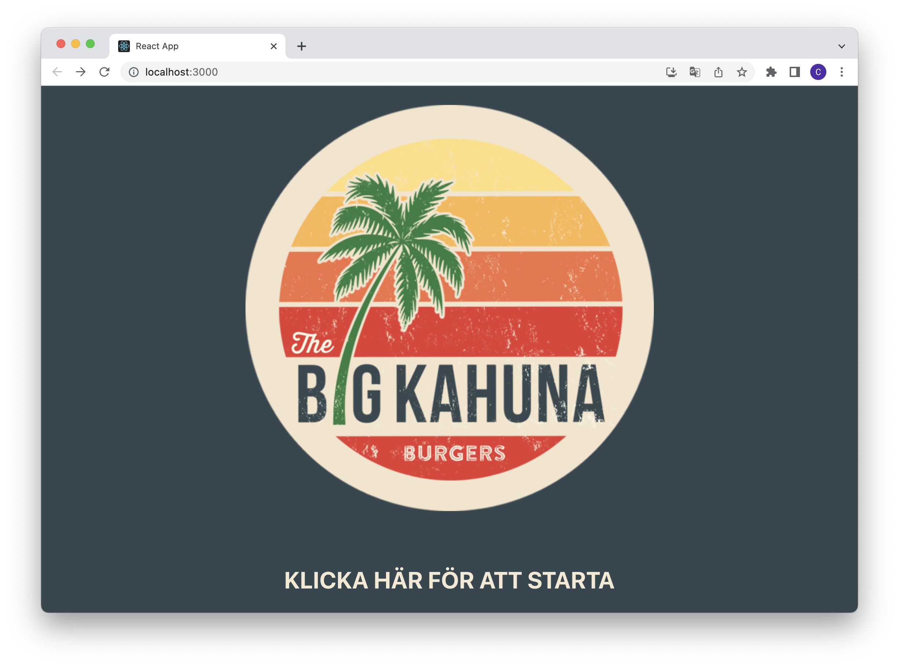
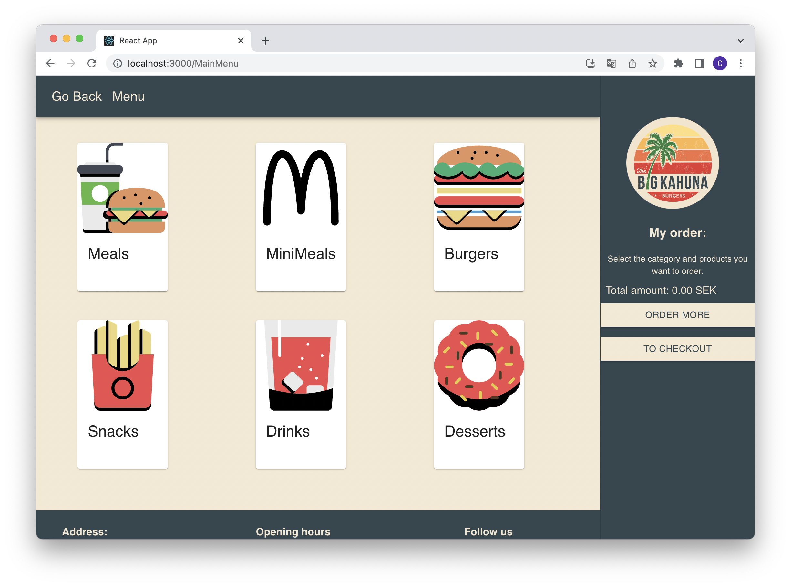
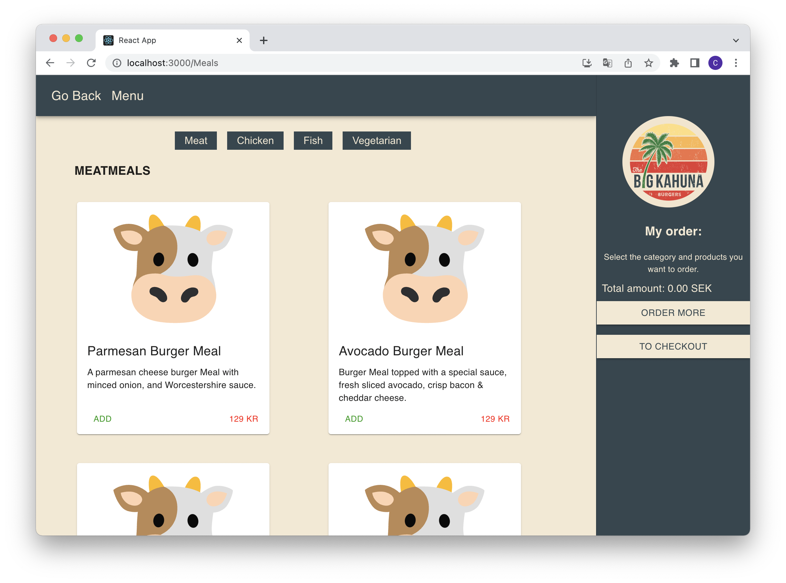
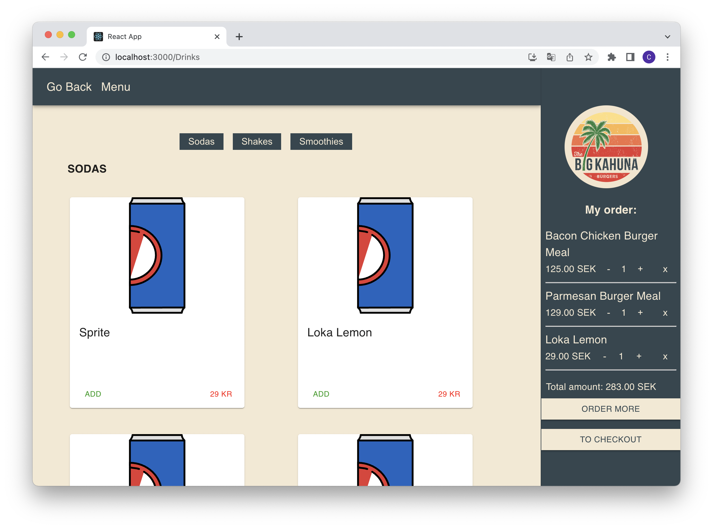
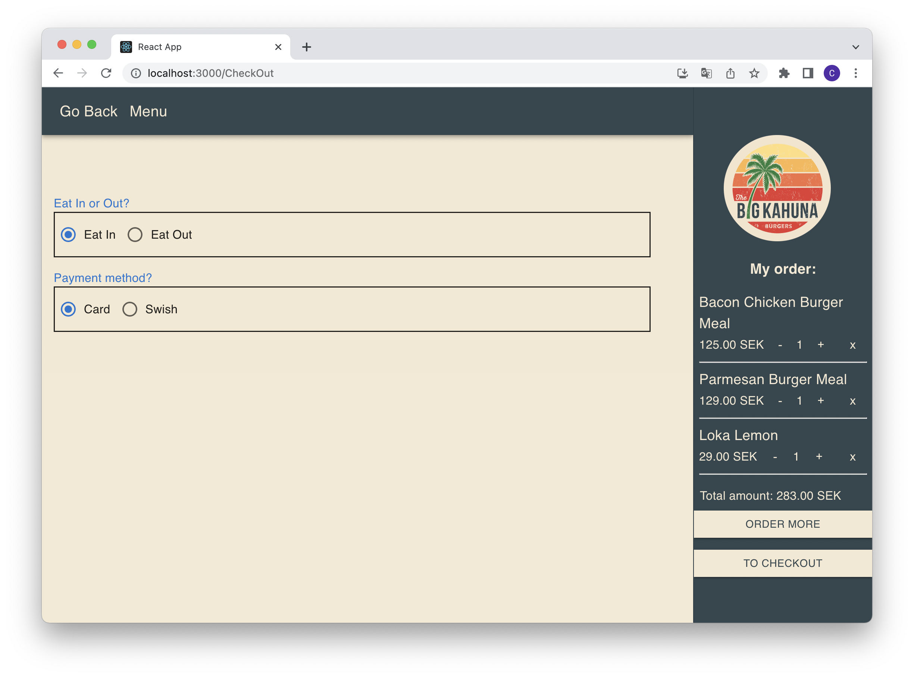

## Project Overview: Self-Service Restaurant Cashier System

# Introduction:
### This project is currently under development and aims to create a self-service restaurant cashier system. It utilizes technologies such as Firebase, React, and TypeScript.

# To start the application, run the following command:
### `npm install`
### `npm start`

# Important!
### This project makes use of media queries to emulate an iPad. Adjust the browser's width to experience the responsive design.